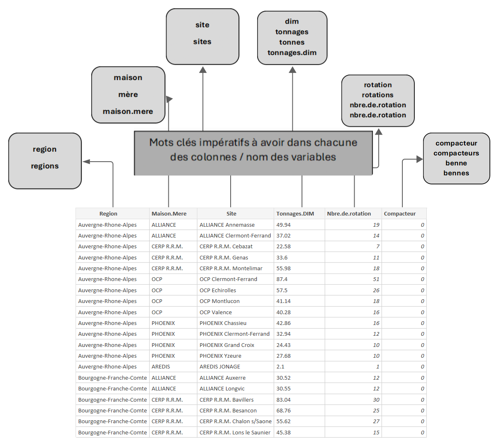

---
output:
  html_document:
    df_print: paged
  pdf_document:
    extra_dependencies: float
    keep_tex: false
  word_document: default
header-includes: "\\usepackage{float} \\usepackage{fancyhdr} \\usepackage{ocgx2} \\usepackage{hyperref}
  \\usepackage{xcolor} \\definecolor{steelblue}{RGB}{70, 130, 180} \\definecolor{lightblue}{RGB}{0,192,239}
  \\definecolor{darkblue}{RGB}{60,141,188} \\definecolor{steelred}{RGB}{221,75,57}
  \\usepackage{listings} \\lstset{frame=tb,language=R,keywordstyle=\\color{blue},alsoletter={.}}
  \\pagestyle{fancy} \\usepackage[section]{placeins} \\definecolor{Grey}{rgb}{0.5,
  0.5, 0.5} \\rhead{\\color{Grey}CyclamedSampleR--Guide} \\lhead{\\color{Grey} Y.M
  D.B R.S T.M} \\definecolor{DarkRed}{rgb}{0.64, 0.0, 0.0} \\setcounter{tocdepth}{2}"
---

```{=tex}
\begin{titlepage}
   \begin{center}
       \vspace*{1cm}
                   
       \textbf{CyclamedSampleR}
       
       \vfill
       
       \textbf{\color{DarkRed} \Huge Guide utilisateur}

       \vspace{0.5cm}
       
       \textbf{\color{DarkRed} \Large Application pour optimiser la séléction de sites pour l'étude de caractérisation}
       
       \vspace{0.5cm}
        
    \textbf{\Large }
    
       \includegraphics[width=0.3\textwidth]{logo.jpg}
    
       \vspace{3cm}

       \textbf{\Large MICHA Yanis,BERGER Dylan,SELVARADJOU Richard,MUTAMU Tony Dassin}

       \vfill
            
       \vspace{0.4cm}
     
       \includegraphics[width=0.25\textwidth]{logo-uga.png}
            
       Université Grenoble Alpes\\
       Master 1 SSD
            
   \end{center}
\end{titlepage}
```
```{=tex}
\newpage
\thispagestyle{empty}
\tableofcontents
```
\newpage

# Objectif de l'application

Cette application a pour principale vocation de permettre la sélection de cinq sites pour l'étude de caractérisation des MNU (Médicaments Non Utilisés). Elle permet également de visualiser les données et de les modifier directement depuis un onglet, ainsi que de visualiser ces données et de les explorer dans un tableau de bord.

# Description des différents onglets et leurs contenus

## Les données:

L'onglet "Les données" vous offre un accès rapide à un tableau complet des sites de grossistes répartiteurs, conçue pour une exploration et une recherche efficace dans l’ensemble.

Vous pouvez aisément trier les sites du tableau selon divers critères, tels que le tonnage ou la région, et lancer des recherches ciblées si besoin.


### Utilisation des boutons de l’onglet

- Bouton "**+**" (Ajouter une ligne dans le tableau/base de données) :\
Ce bouton vous permet d'intégrer un nouveau site à la liste des grossistes répartiteurs. En cliquant dessus, un menu déroulant s'affiche, présentant les champs correspondants aux variables à renseigner. 
 
Vous avez la possibilité d’ajouter une nouvelle « Maison mère » si besoin en effaçant dans la maison, en écrivant une nouvelle et en cliquant sur « **Add** ».

Après avoir saisi les informations requises, cliquez sur "Nouvelle ligne" pour ajouter le site au tableau. 

*Veuillez noter qu'il est impératif d'éviter les valeurs négatives pour les variables numériques telles que le tonnage et le nombre de rotations. De plus, l'ajout d'un site modifie immédiatement la classification et la sélection des sites dans la base de données.*


- Bouton " **Éditer** " (Edition d’une ligne) :\
Ce bouton permet de modifier les informations d'un site spécifique. Sélectionnez la ligne souhaitée pour afficher une fenêtre d'édition. Vous pouvez ainsi apporter des ajustements précis aux variables de la ligne concernée. Une fois les modifications effectuées, cliquez sur "Sauvegarder" pour enregistrer les changements. 

Vous avez également la possibilité de double-cliquer sur une cellule spécifique du tableau pour une édition rapide.

Assurez-vous de ne pas saisir de valeurs négatives pour le Tonnage et le nombre de rotations.

- Bouton " **Supprimer** " (Suppression d’une ligne):\
En sélectionnant une ou plusieurs lignes, ce bouton vous permet d'éliminer des sites de la liste. Utilisez-le avec précaution pour ne pas supprimer de données essentielles.

**Points importants sur les boutons « Éditer » et « Supprimer »**:\
Ces deux boutons sont interactifs et n’apparaissent que si vous cliquez sur une (max 1 pour l’édition) ou plusieurs (>= 1 pour la suppression).

- Bouton "**Importer de nouvelles données**" (Import un fichier) :\
Ce bouton ouvre votre explorateur de fichiers pour vous permettre d'importer un nouveau jeu de données. Les informations importées remplaceront les données existantes. Le fichier importer doit être sous le format .csv.

**Points importants sur les variables/colonnes du fichier .csv importer** :\
-	Le fichier doit contenir exactement 6 variables/colonnes.
-	Garder les mêmes noms des variables/colonnes.
-	Les variables doivent être organisées successivement de la première à la sixième la sorte *"Region", "Maison.Mere", "Site", "Tonnages.DIM", "Nbre.de.rotation", "Compacteur"*
-	Les variables doivent contenir au moins un mot clé comme spécifié dans le graphique ci-dessous.

Voici un ***fichier type*** du format des colonnes/variables à retrouver dans le .csv importé :\

{width=200px}
**Notes sur la nature des valeurs (type) des variables/colonnesdu tableau** :\
- Region :"Chaine de caractères" (" Character"/ "String")
- "Maison.Mere" :"Chaine de caractères" (" Character"/ "String")
- "Site":"Chaine de caractères" (" Character"/ "String")
- "Tonnages.DIM":"Numérique" ("numeric"/"double")
- "Nbre.de.rotation":"Entier"("Integer")
- "Compacteur":"Entier"("Integer")

- Bouton "**Sauvegarder**" \
Utilisez ce bouton pour télécharger le tableau des grossistes répartiteurs au format .CSV, que vous pourrez ensuite enregistrer à l'emplacement de votre choix. Cette fonction est particulièrement utile pour conserver une trace des modifications apportées.

## Sélection des sites:

Cet onglet permet de réaliser un tirage aléatoire de cinq sites pour permettre l'étude de caractérisation de l'année à venir. Ce tirage choisit un site par classe, construite à l'aide d'un plan de sondage stratifié réalisé lors d'une [étude antérieure](https://www.dropbox.com/scl/fi/eq6d5hp2shufl4js1uadk/Cyclamed_EtudeCaracterisation2022.pdf?rlkey=wizxd1ohkoc5gpvg128i8w31l&dl=1).\
Quelques fonctionnalités sont disponibles en plus du tirage: - la possibilité de relancer le tirage plusieurs fois avec remise pour tous les sites. - Possibilité de relancer le tirage plusieurs fois avec remise pour un ou plusieurs sites spécifiques - Possibilité de choisir directement dans la liste des classes.(Non conseillé) - Information sur les sites choisis - Indications des sites avec ou sans compacteurs. - Indication des sites Outre-Mer. - Affichage d'informations sur les classes: intervalles de tonnage des DIM,nombre de sites total, nombre de sites avec compacteur, nombre de sites outre-mers,etc.

Les différentes classes sont récupérés avec la fonction `stratopt` qui implémente le plan de sondage stratifié optimisé:

```{=tex}
\textbf{\textcolor{steelblue}{\switchocg{myLayer}{Afficher le code R}}}
\begin{ocg}{My Layer}{myLayer}{off}
\begin{lstlisting}[language=R]
stratopt<-function(data){
  cum<-strata.cumrootf(x=data$Tonnages.DIM,n=5,Ls=5,alloc=c(0.5,0,0.5),nclass = 200)
  class_opt<-numeric(dim(data)[1])
  class_opt<-as.numeric(data$Tonnages.DIM<=cum$bh[1])+
  2*as.numeric(data$Tonnages.DIM>cum$bh[1]&data$Tonnages.DIM<=cum$bh[2])+
  3*as.numeric(data$Tonnages.DIM>cum$bh[2]&data$Tonnages.DIM<=cum$bh[3])+
  4*as.numeric(data$Tonnages.DIM>cum$bh[3]&data$Tonnages.DIM<=cum$bh[4])+
  5*as.numeric(data$Tonnages.DIM>cum$bh[4])

data_opt<-data.frame(data,class_opt)

list_opt<-list(classe1=data_opt$Site[data_opt$class_opt==1],
               classe2=data_opt$Site[data_opt$class_opt==2],
               classe3=data_opt$Site[data_opt$class_opt==3],
               classe4=data_opt$Site[data_opt$class_opt==4],
               classe5=data_opt$Site[data_opt$class_opt==5])
  
return(list_opt)

\end{lstlisting}
\end{ocg}
```
### Utilisation de l'onglet

**Utilisation des bouttons**:

-   Bouton "tirage aléatoire"\
    Ce boutton permet de réaliser un tirage des sites pour chaque classe à l'aide de la fonction `stratopt` décrite précedemment. Une fois cliqué, une fenêtre s'ouvre pour valider le tirage ou non afin d'éviter une erreur de tirage.\
    Si le tirage s'avère ne pas être le premier, les site de nouveau tirés aléatoirement seront ceux dont le boutton/interrupteur de la classe correspondante aura été décoché (cadenas ouvert).\
-   Bouton "Enregistrer"\
    Ce boutton permet de valider un tirage complet des cinq sites pour une année donnée.\
    Une fois cliqué, une fenêtre s'ouvre pour confirmer la validation. Une ligne est alors ajouté dans l'historique avec la possibilité d'y ajouter un commentaire.\
    Il s'affiche uniquement lorsque les cinq classes ont leur boutton "garder le site" activé.\
-   Boutton "Historique"\
    Permet d'afficher l'historique des précédents tirages.

**Utilisation des cadres**:\
Sur la droite de l'onglet sont présents cinq cadres présentant respectivement les cinqs classes du plan d'échantillonnage stratifié.

\includegraphics[width=1\textwidth]{cadre.png}

On y retrouve:

-   le nom de la classe
-   un boutton \textbf{\textcolor{steelblue}{information}}\
    Il vous suffit de placer la souris sur ce boutton pour afficher des informations sur la classe.\
-   un menu déroulant permettant de visualiser l'ensemble des sites présents dans la classe et de les séléctionner. Il est également possible de faire un recherche d'un site en particulier au sein d'une classe.\
    Afin de distinguer certaines spécificités importantes à prendre en compte lors du tirage, un code couleur à été crée:
    -   \textcolor{lightblue}{Bleu clair}: correspond à un site présent sur un territoire outre-mer.
    -   \textcolor{darkblue}{Bleu foncé}: correspond à un site classique présent sur le territoire métropolitain.
    -   \textcolor{steelred}{Rouge foncé}: correspond à un site avec la présence d'un compacteur.\
        Ce code couleur est utilisé non seulement à l'intérieur du menu déroulant mais également lors de l'affichage du site tiré.\
-   un boutton interrupteur.\
    Ce boutton s'active automatiquement lorsqu'un tirage est réalisé. En le décochant, il permet de réaliser un nouveau tirage d'un site pour une classe donnée. Si l'on souhaite réaliser un nouveau tirage de l'ensemble des classes, il suffit de décocher le boutton de chaque classe.\
    Au centre de chaque cadre est affiché le site tiré aléatoirement de la classe avec le code couleur correspondant (nécessite au moins un premier tirage pour permettre de le visualiser).

**Utilisation de l'historique**:\
Une ligne de l'historique représente un tirage et est composé de la date (au format jour/mois/annee heure),des cinq sites tirés,de l'état du tirage,d'un commentaire,et de l'année pour laquelle le tirage a été effectué.\
Parmi ces neuf colonnes, seul les trois dernières sont modifiables directement depuis l'interface.

-   Etat:

    -   \textcolor{green}{Valide}: indique qu'il s'agit du tirage définitif pour la caractérisation de l'année indiquée.

    -   \textcolor{yellow}{En attente de validation}: indique que le tirage n'est pas définitif et qu'il peut changer selon la situation (pas certain de pouvoir se rendre sur un site,de pouvoir place rune benne à côté d'un site avec compacteur,etc.).

    -   \textcolor{steelred}{Non valide}: indique que ce tirage ne sera pas utilisé pour la caractérisation.\
        Cet etat peut-être modifié directement, à savoir que "valide","validé","valider" sont autorisés pour \textcolor{green}{Valide},"en attente" avec n'importe quoi après suffit pour \textcolor{yellow}{En attente de validation} et que tout autre écrit sera transformé automatiquement en \textcolor{steelred}{Non valide}.\
        A savoir que l'écriture de l'état n'est pas sensible à la casse (majuscule ,minuscule).

-   Commentaire:

    Tout type de commentaire sont acceptés, aucune restriction quant à la modification,suppression d'un commentaire.

-   Caractérisation: représente l'année de caractérisation pour laquelle va être utilisée le tirage. Par défaut,l'année de caractéristation enregistré sera la même que le précédent tirage. Il est possible de la modifier mais l'année doit obligatoirement être écrite en chiffre et ne pas précéder 2024 (année de création de l'interface).

## Statistiques

### Résumés

L'onglet de résumé statistique fournit un aperçu des variables qualitatives telles que la région, la maison mère et le site, ainsi que des variables quantitatives comme le tonnage DIM (Déchêts issus de médicaments), le nombre de rotations et la présence d’un compacteur, à partir du fichier de données "tonnage".  Il permet également de discriminer les informations des sites par classes correspondantes au plan d'échantillonnage stratifié .  Pour les variables qualitatives, il présente des analyses d’effectifs, d’effectifs cumulées et de pourcentage. Pour les variables quantitatives, il affiche des paramètres statistiques tels que le minimum, le premier quartile, la médiane, la moyenne, le troisième quartile et le maximum. De plus, il offre la possibilité de sélectionner une variable spécifique pour une analyse plus détaillée, y compris la présence d’un compacteur. 


Nous allons expliquer le fonctionnement de l'onglet. Sur le côté gauche, vous avez la possibilité de choisir une variable mentionnée précédemment dans un menu déroulant. Ensuite, il vous suffit de cliquer sur le bouton "Lancer" pour afficher le résultat. Celui-ci s'affiche ensuite à droite, dans le panneau principal.  

\includegraphics[width=1\textwidth]{onglet_summary.png}

Il est également possible de croiser la variable principale avec une autre variable qualitative. Pour ce faire, cochez simplement la case "Oui", et deux menus déroulants apparaîtront. Vous devrez ensuite sélectionner la variable avec laquelle vous souhaitez croiser, ainsi que la partie spécifique de la population à considérer. Ensuite, cliquez sur le bouton "Lancer" pour obtenir le résultat affiché dans le panneau principal.  

\includegraphics[width=1\textwidth]{onglet_summary2.png}  


### Tableau de bord

Ce tableau de bord permet d'explorer de manière approfondie les données des différents sites de MNU à travers une série de visualisations graphiques interactives. L'interface inclut quatre principaux types de graphiques :

### Types de Graphiques

1. **Graphique en secteurs** : Utilisé pour visualiser la proportion de la présence de compacteurs. Un clic sur un secteur permet de filtrer les autres graphiques selon la catégorie sélectionnée.
2. **Graphique de dispersion** : Affiche le nombre de rotations par rapport au tonnage, avec des données qui peuvent être filtrées en fonction des sélections effectuées sur d'autres graphiques.
3. **Graphique à boîtes à moustaches** : Présente la distribution du tonnage par classe, adaptable selon les filtres appliqués sur les autres visualisations.
4. **Graphique en barres** : Comprend une liste déroulante pour choisir parmi différentes visualisations, telles que tonnage par classe, région ou maison mère.

### Interactions et Fonctionnalités Additionnelles

- **Interactivité entre graphiques** : Les clics sur les éléments des graphiques région ou maison mère déclenchent des pop-ups fournissant des informations détaillées sur les sites de la région ou maison mère sélectionnée et filtrent simultanément les graphiques de dispersion et à boîtes à moustaches.
- **Filtre par compacteur** : Le graphique en secteurs permet de filtrer les autres visualisations en fonction de la présence ou non de compacteurs.
- **Réinitialisation** : Un bouton ‘Réinitialiser la sélection’ est disponible pour effacer tous les filtres appliqués et revenir à l'affichage initial.
- **Bibliothèque graphique fonctionnalité** : Plotly, la bibliothèque utilisée pour les graphiques, offre des fonctionnalités telles que le zoom (en traçant un rectangle ou via les boutons de zoom, tandis qu'un double-clic réinitialise le zoom à l'état d'origine) et la manipulation de l'affichage des légendes (un clic simple sur une légende cache la série correspondante).

Tous les graphiques sont interactifs. Des informations supplémentaires sont aussi disponibles en survolant les éléments des graphiques.

